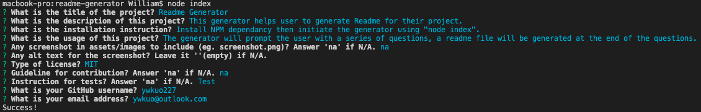

# ReadMe Generator 

## Description
This generator helps user to generate a quality ReadMe file for their project.

## Table of Contents
- [Installation](#installation)
- [Usage](#usage)

- [Questions](#questions)

## Installation
Install NPM dependancy through Integrated Terminal, then initate the generator using "node index".

## Usage
The generator will prompt the user with a series of questions, a ReadMe file is generated at the end of the questions.

## Questions
GitHub: [ywkuo227's GitHub](https://github.com/ywkuo227)

Email: [ywkuo@outlook.com](mailto:ywkuo@outlook.com)